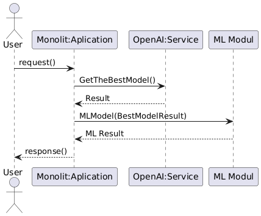

# Aplikcja SI do wypełniana pustej kolumny w ramce danych
## Założenia projektu
Projekt jest realizowany w ramach przedmiotu Wstęp do przetwarzania w chmurze na uniwersytecie Vistula kierunku Informatyka.  
### Użyte technologie w projekcie
* Python
* OpenAi API
* scikit-learn
* xgboost
* Pandas
* FastApi
### Założenia projektu 
Aplikacja ma przyjąć request w formie 
```json
{
    "column" : "nazwa kolumny",
    "data" :  {json, orientation = 'index'}
}
```
Aplikacja wykorzystuje gpt-4o do przeanalizowania pierwszych 1000 rekordów do wybrania najbardziej optymalnego modelu klasyfikacyjnego z 3 modeli:
* RandomForestClassifier
* LogisticRegression
* XGBClassifier  
Modół AI zwraca słownik, który wygląda następująco
```python
{
    "BestModel": nazwa_modelu,
    "Accuracy": przewidywany wynik Accuracy,
    "Precision": przewidywany wynik Precision,
    "Recall": przewidywany wynik Recall,
    "F1-Score": przewidywany wynik F1-Score
}
```
Następnie modół ML na podstawie inputu uczy wybrany model w celu uzupełnienia wybranej kolumny
Aplikacja zwraca użytkownikowi następującego jsona
```json
{
    "LLM_BestModel" : {
        "BestModel": nazwa_modelu,
        "Accuracy": przewidywany wynik Accuracy,
        "Precision": przewidywany wynik Precision,
        "Recall": przewidywany wynik Recall,
        "F1-Score": przewidywany wynik F1-Score
        },
    "Model_Metrics": {
        "Accuracy": wynik Accuracy z wytenowanego modelu,
        "Precision": wynik Precision z wytenowanego modelu,
        "Recall": wynik Recall z wytenowanego modelu,
        "F1-Score":  wynik F1-Score z wytenowanego modelu
        },
    "Predicted_Data" :{
        dataframe w formie json index oriented
    }
}
```
